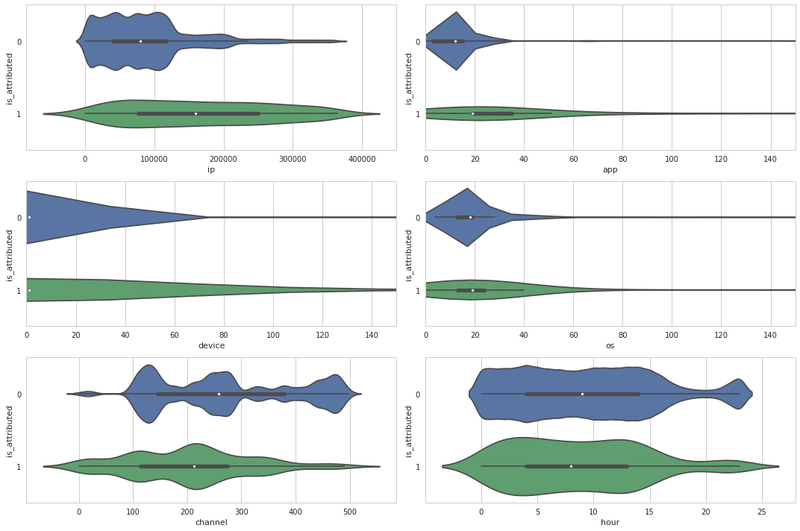
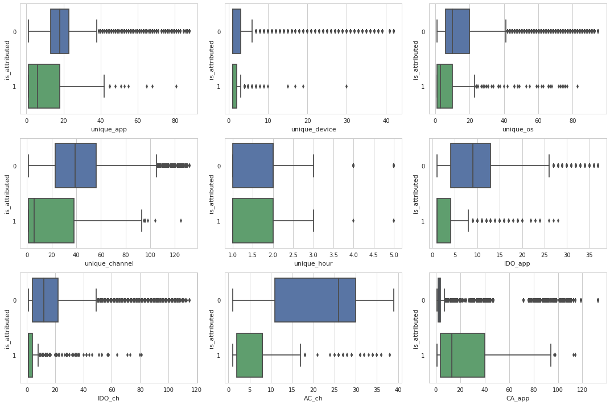
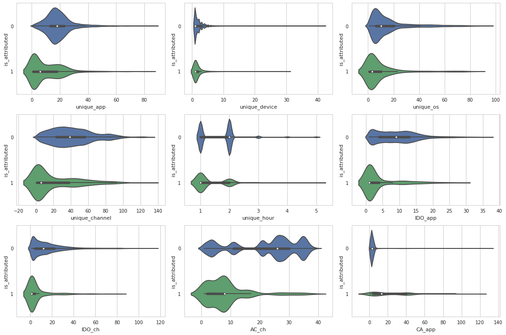
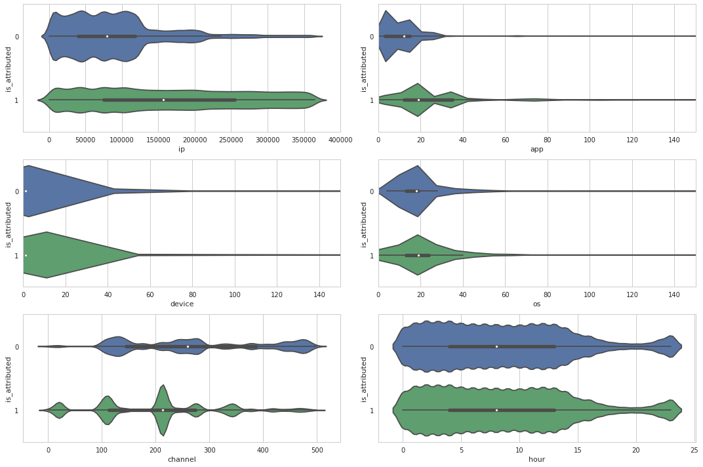
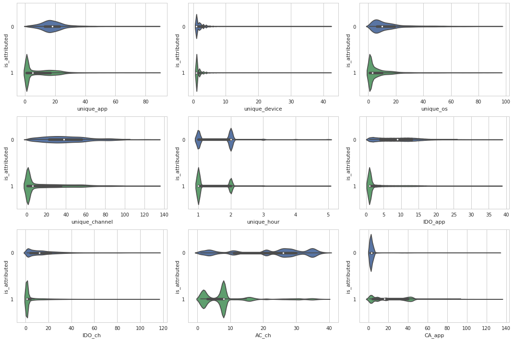

# TalkingData-Fraud-Detection


```python
%matplotlib inline

df = pd.read_csv("./train.csv", nrows=2000)
df.tail(2)
```
<div>
<table border="1" class="dataframe">
  <thead>
    <tr style="text-align: right;">
      <th></th>
      <th>ip</th>
      <th>app</th>
      <th>device</th>
      <th>os</th>
      <th>channel</th>
      <th>click_time</th>
      <th>attributed_time</th>
      <th>is_attributed</th>
    </tr>
  </thead>
  <tbody>
    <tr>
      <th>1998</th>
      <td>73839</td>
      <td>12</td>
      <td>1</td>
      <td>17</td>
      <td>265</td>
      <td>2017-11-06 16:00:02</td>
      <td>NaN</td>
      <td>0</td>
    </tr>
    <tr>
      <th>1999</th>
      <td>105475</td>
      <td>14</td>
      <td>1</td>
      <td>44</td>
      <td>480</td>
      <td>2017-11-06 16:00:02</td>
      <td>NaN</td>
      <td>0</td>
    </tr>
  </tbody>
</table>
</div>


dataset 은 이런식으로 생겼습니다.

- kaggle에서 데이터셋을 받고 압축을 풀어보시면, 7G가 넘는 방대한 데이터셋을 보실 수 있습니다.
- 십만개의 데이터로 구성된 train_sample만 이용하셔도 괜찮습니다.

    https://www.kaggle.com/c/talkingdata-adtracking-fraud-detection/data

# EDA
탐색적 데이터 분석, 즉 분석 기법 등을 쓰지 않고 데이터 자체를 확인하는 과정입니다.

- 일반적으로
데이터 전처리는 데이터 셋 확인, 결측값 처리, 이상값 처리, Feature Engineering 으로 진행됩니다.
- Fraud-Detection 데이터는 결측값이 없고, 데이터도 click_time 하나를 제외하고는 모두 숫자로 구성되어 있기 때문에 전처리 할 것이 거의 없습니다.
- attributed_time은 is_attributed가 1인 데이터들만 존재하기 때문에 인사이트를 얻을 수는 있지만, 학습에는 사용하지 않습니다.

아래 변수 설명은 Kaggle에서 발췌해왔습니다.

### 독립 변수 (independent variables)

#### User Discriminator
 - `ip`: ip address of click.

 - `device`: device type id of user mobile phone
    - (e.g., iphone 6 plus, iphone 7, huawei mate 7, etc.)

 - `os`: os version id of user mobile phone

제가 생각하기에, 고유 유저를 구분짓는 변수가 아닐까 합니다.

#### Ad Discriminator
 - `app`: app id for marketing.
 - `channel`: channel id of mobile ad publisher

ad의 출처 등을 구분짓는 변수라고 생각합니다.

#### others
 - `click_time`: timestamp of click (UTC)
 - `attributed_time`: if user download the app for after clicking an ad, this is the time of the app download

### 종속 변수 (dependent variable)

- `is_attributed`: the target that is to be predicted, indicating the app was downloaded


`Note that ip, app, device, os, and channel are encoded.`

변수들이 인코딩되었다고 합니다. 보안문제도 있었을테지만, 아무튼 인코딩하는 과정이 줄어 땡큐네요.
- 일반적으로는 직접 인코딩을 거치는 경우가 많습니다.

---

### 평가 방식 (Evaluation)

**AUC** : Area Under the ROC curve (ROC - Receiver Operating Characteristic curve)

- ROC커브란

    **1.** 클래스 판별 기준값 변화에 따른(threshold)

    **2.** recall과 **3.** fall-out의 변화를 시각화한 것이고,


- AUC는 ROC커브 아랫 부분의 면적을 의미합니다.

*이게 무슨 소리냐 하시면..*

일단 분류 결과표부터.

|실제\예측 | Positive 라고 예측 | Negative 라고 예측|
| -- | -- | -- |
|실제 Positive| True Positive | False Negative
|실제 Negative| False Positive | True Negative

1. 클래스 판별 기준값

    모델링 후에 예측을 진행하면, 고객의 앱 구매 여부에 대한 예측값이 1과 0 사이의 어떤 확률값으로 나오게 될것입니다.
    클래스 판별 기준값 설정에 따라 70% 확률부터 앱을 구매했다고 판별할지, 0.1% 확률만 있어도 앱을 구매했다고 판별할지 정하게 됩니다.
    > 모든 이진 분류 모형은 판별 평면으로부터의 거리에 해당하는 판별 함수(discriminant function)를 가지며 판별 함수 값이 음수이면 0인 클래스, 양수이면 1인 클래스에 해당한다고 판별한다. 즉 0 이 클래스 판별 기준값이 된다. ROC 커브는 이 클래스 판별 기준값이 달라진다면 판별 결과가 어떻게 달라지는지를 표현한 것이다.  
>https://datascienceschool.net/view-notebook/731e0d2ef52c41c686ba53dcaf346f32/
1. recall (True Positive rate, sensitivity, 재현율)

    실제 앱을  **구매한** click 중 **구매했다고** 출력한 click의 수

1. fall-out (False Positive rate, 위양성률)

    실제 앱 구매하지 **않은** click 중 클래스에 **구매했다고** 출력한 click의 수


일반적으로 클래스 판별 기준(Threshold)이 변화함에 따라 Recall과 Fall-out은 같이 증가하거나 감소합니다. 따라서 Fall-out보다 Recall이 더 빠르게 증가하는 모형일수록 AUC가 1에 가까운 모형이며, 좋은(민감한) 모형이라고 합니다.

---


```python
df = pd.read_csv("./data/edited.csv", skiprows=lambda i: i % 1000 != 0)
df.tail()
```


<div>
<table border="1" class="dataframe">
  <thead>
    <tr style="text-align: right;">
      <th></th>
      <th>ip</th>
      <th>app</th>
      <th>device</th>
      <th>os</th>
      <th>channel</th>
      <th>is_attributed</th>
      <th>hour</th>
      <th>unique_app</th>
      <th>unique_device</th>
      <th>unique_os</th>
      <th>unique_channel</th>
      <th>unique_hour</th>
      <th>IDO_app</th>
      <th>IDO_ch</th>
      <th>AC_ch</th>
      <th>CA_app</th>
    </tr>
  </thead>
  <tbody>
    <tr>
      <th>184898</th>
      <td>86767</td>
      <td>94</td>
      <td>1</td>
      <td>13</td>
      <td>361</td>
      <td>0</td>
      <td>15</td>
      <td>34</td>
      <td>3</td>
      <td>43</td>
      <td>108</td>
      <td>1</td>
      <td>31</td>
      <td>84</td>
      <td>2</td>
      <td>1</td>
    </tr>
    <tr>
      <th>184899</th>
      <td>364401</td>
      <td>94</td>
      <td>1</td>
      <td>13</td>
      <td>361</td>
      <td>0</td>
      <td>15</td>
      <td>13</td>
      <td>1</td>
      <td>1</td>
      <td>20</td>
      <td>1</td>
      <td>13</td>
      <td>20</td>
      <td>2</td>
      <td>1</td>
    </tr>
    <tr>
      <th>184900</th>
      <td>77257</td>
      <td>29</td>
      <td>1</td>
      <td>3</td>
      <td>343</td>
      <td>0</td>
      <td>15</td>
      <td>20</td>
      <td>3</td>
      <td>14</td>
      <td>48</td>
      <td>1</td>
      <td>1</td>
      <td>1</td>
      <td>14</td>
      <td>3</td>
    </tr>
    <tr>
      <th>184901</th>
      <td>99020</td>
      <td>29</td>
      <td>1</td>
      <td>1</td>
      <td>343</td>
      <td>0</td>
      <td>15</td>
      <td>6</td>
      <td>1</td>
      <td>3</td>
      <td>6</td>
      <td>1</td>
      <td>1</td>
      <td>1</td>
      <td>14</td>
      <td>3</td>
    </tr>
    <tr>
      <th>184902</th>
      <td>64049</td>
      <td>160</td>
      <td>1</td>
      <td>19</td>
      <td>457</td>
      <td>0</td>
      <td>15</td>
      <td>20</td>
      <td>1</td>
      <td>5</td>
      <td>33</td>
      <td>1</td>
      <td>18</td>
      <td>25</td>
      <td>1</td>
      <td>1</td>
    </tr>
  </tbody>
</table>
</div>


```python
df.describe()
```


<div>
<table border="1" class="dataframe">
  <thead>
    <tr style="text-align: right;">
      <th></th>
      <th>ip</th>
      <th>app</th>
      <th>device</th>
      <th>os</th>
      <th>channel</th>
      <th>is_attributed</th>
      <th>hour</th>
      <th>unique_app</th>
      <th>unique_device</th>
      <th>unique_os</th>
      <th>unique_channel</th>
      <th>unique_hour</th>
      <th>IDO_app</th>
      <th>IDO_ch</th>
      <th>AC_ch</th>
      <th>CA_app</th>
    </tr>
  </thead>
  <tbody>
    <tr>
      <th>count</th>
      <td>184903.000000</td>
      <td>184903.000000</td>
      <td>184903.000000</td>
      <td>184903.000000</td>
      <td>184903.000000</td>
      <td>184903.000000</td>
      <td>184903.000000</td>
      <td>184903.000000</td>
      <td>184903.000000</td>
      <td>184903.000000</td>
      <td>184903.000000</td>
      <td>184903.000000</td>
      <td>184903.00000</td>
      <td>184903.000000</td>
      <td>184903.000000</td>
      <td>184903.000000</td>
    </tr>
    <tr>
      <th>mean</th>
      <td>91013.889672</td>
      <td>12.132053</td>
      <td>21.783286</td>
      <td>22.652591</td>
      <td>268.585123</td>
      <td>0.002493</td>
      <td>9.300006</td>
      <td>19.291044</td>
      <td>2.375240</td>
      <td>16.585718</td>
      <td>41.766418</td>
      <td>1.653791</td>
      <td>9.36934</td>
      <td>16.421626</td>
      <td>21.783741</td>
      <td>3.895118</td>
    </tr>
    <tr>
      <th>std</th>
      <td>69723.809109</td>
      <td>16.254858</td>
      <td>259.553787</td>
      <td>55.606948</td>
      <td>129.584146</td>
      <td>0.049870</td>
      <td>6.171851</td>
      <td>10.414113</td>
      <td>2.947847</td>
      <td>16.965074</td>
      <td>24.416244</td>
      <td>0.711170</td>
      <td>6.30194</td>
      <td>16.680015</td>
      <td>11.345737</td>
      <td>8.123366</td>
    </tr>
    <tr>
      <th>min</th>
      <td>6.000000</td>
      <td>0.000000</td>
      <td>0.000000</td>
      <td>0.000000</td>
      <td>0.000000</td>
      <td>0.000000</td>
      <td>0.000000</td>
      <td>1.000000</td>
      <td>1.000000</td>
      <td>1.000000</td>
      <td>1.000000</td>
      <td>1.000000</td>
      <td>1.00000</td>
      <td>1.000000</td>
      <td>1.000000</td>
      <td>1.000000</td>
    </tr>
    <tr>
      <th>25%</th>
      <td>40245.000000</td>
      <td>3.000000</td>
      <td>1.000000</td>
      <td>13.000000</td>
      <td>140.000000</td>
      <td>0.000000</td>
      <td>4.000000</td>
      <td>13.000000</td>
      <td>1.000000</td>
      <td>6.000000</td>
      <td>23.000000</td>
      <td>1.000000</td>
      <td>4.00000</td>
      <td>4.000000</td>
      <td>11.000000</td>
      <td>2.000000</td>
    </tr>
    <tr>
      <th>50%</th>
      <td>79827.000000</td>
      <td>12.000000</td>
      <td>1.000000</td>
      <td>18.000000</td>
      <td>258.000000</td>
      <td>0.000000</td>
      <td>9.000000</td>
      <td>18.000000</td>
      <td>1.000000</td>
      <td>10.000000</td>
      <td>39.000000</td>
      <td>2.000000</td>
      <td>9.00000</td>
      <td>12.000000</td>
      <td>26.000000</td>
      <td>3.000000</td>
    </tr>
    <tr>
      <th>75%</th>
      <td>118229.000000</td>
      <td>15.000000</td>
      <td>1.000000</td>
      <td>19.000000</td>
      <td>379.000000</td>
      <td>0.000000</td>
      <td>14.000000</td>
      <td>23.000000</td>
      <td>3.000000</td>
      <td>20.000000</td>
      <td>56.000000</td>
      <td>2.000000</td>
      <td>13.00000</td>
      <td>22.000000</td>
      <td>30.000000</td>
      <td>4.000000</td>
    </tr>
    <tr>
      <th>max</th>
      <td>364776.000000</td>
      <td>755.000000</td>
      <td>3867.000000</td>
      <td>866.000000</td>
      <td>498.000000</td>
      <td>1.000000</td>
      <td>23.000000</td>
      <td>88.000000</td>
      <td>42.000000</td>
      <td>95.000000</td>
      <td>132.000000</td>
      <td>5.000000</td>
      <td>37.00000</td>
      <td>115.000000</td>
      <td>39.000000</td>
      <td>133.000000</td>
    </tr>
  </tbody>
</table>
</div>


```python
df.columns
```


    Index(['ip', 'app', 'device', 'os', 'channel', 'is_attributed', 'hour',
           'unique_app', 'unique_device', 'unique_os', 'unique_channel',
           'unique_hour', 'IDO_app', 'IDO_ch', 'AC_ch', 'CA_app'],
          dtype='object')


## Categorical Features

click_time에서 hour만 추출해 변수로 사용했습니다. 나머지는 주어진대로.


```python
plt.figure(figsize=(15,10))
plt.subplot(321)
sns.violinplot(x = 'ip', y = 'is_attributed', data=df, orient='h')
plt.subplot(322)
sns.violinplot(x = 'app', y = 'is_attributed', data=df, orient='h')
plt.xlim(0, 150)
plt.subplot(323)
sns.violinplot(x = 'device', y = 'is_attributed', data=df, orient='h')
plt.xlim(0, 150)
plt.subplot(324)
sns.violinplot(x = 'os', y = 'is_attributed', data=df, orient='h')
plt.xlim(0, 150)
plt.subplot(325)
sns.violinplot(x = 'channel', y = 'is_attributed', data=df, orient='h')
plt.subplot(326)
sns.violinplot(x = 'hour', y = 'is_attributed', data=df, orient='h')
plt.tight_layout()
plt.show()
```





클래스에 따라 분포의 모양이 다른 걸 보니, 앱을 구매한 여부에 대한 설명력이 있는 변수들인듯 싶습니다.
- app, device, os의 경우에는 비대칭 데이터이기 때문에 다른 분포처럼 보이는 걸 수도 있습니다.

### feature engineering
주어진 자료들로 만들어냈던 변수들입니다.
 `0.edit_data.py` 에 코드가 있습니다.

- unique_&&:  동일 ip 그룹별로 이용된 (app, device, os, channel, hour) 갯수
- IDO_app : 동일 ip-device-os 그룹별로 이용된 app 갯수
- IDO_ch : 동일 ip-device-os 그룹별로 이용된 channel 갯수
- AC_ch : app별 광고 channel 갯수
- CA_app : channel별 담당 app 갯수

## Numerical Features
Boxplot과 vilolinplot으로 그려봤습니다.
시각화는 해도해도 어렵습니다.


```python
plt.figure(figsize=(15,10))
plt.subplot(331)
sns.boxplot(x = 'unique_app', y = 'is_attributed', data=df, orient='h')
plt.subplot(332)
sns.boxplot(x = 'unique_device', y = 'is_attributed', data=df, orient='h')
plt.subplot(333)
sns.boxplot(x = 'unique_os', y = 'is_attributed', data=df, orient='h')
plt.subplot(334)
sns.boxplot(x = 'unique_channel', y = 'is_attributed', data=df, orient='h')
plt.subplot(335)
sns.boxplot(x = 'unique_hour', y = 'is_attributed', data=df, orient='h')
plt.subplot(336)
sns.boxplot(x = 'IDO_app', y = 'is_attributed', data=df, orient='h')
plt.subplot(337)
sns.boxplot(x = 'IDO_ch', y = 'is_attributed', data=df, orient='h')
plt.subplot(338)
sns.boxplot(x = 'AC_ch', y = 'is_attributed', data=df, orient='h')
plt.subplot(339)
sns.boxplot(x = 'CA_app', y = 'is_attributed', data=df, orient='h')
plt.tight_layout()
plt.show()
```





```python
plt.figure(figsize=(15,10))
plt.subplot(331)
sns.violinplot(x = 'unique_app', y = 'is_attributed', data=df, orient='h', split=True)
plt.subplot(332)
sns.violinplot(x = 'unique_device', y = 'is_attributed', data=df, orient='h')
plt.subplot(333)
sns.violinplot(x = 'unique_os', y = 'is_attributed', data=df, orient='h')
plt.subplot(334)
sns.violinplot(x = 'unique_channel', y = 'is_attributed', data=df, orient='h')
plt.subplot(335)
sns.violinplot(x = 'unique_hour', y = 'is_attributed', data=df, orient='h')
plt.subplot(336)
sns.violinplot(x = 'IDO_app', y = 'is_attributed', data=df, orient='h')
plt.subplot(337)
sns.violinplot(x = 'IDO_ch', y = 'is_attributed', data=df, orient='h')
plt.subplot(338)
sns.violinplot(x = 'AC_ch', y = 'is_attributed', data=df, orient='h')
plt.subplot(339)
sns.violinplot(x = 'CA_app', y = 'is_attributed', data=df, orient='h')
plt.tight_layout()
plt.show()
```





### 비대칭 문제가 해결된다면?

undersampling으로 과도하게 많은 클래스를 줄였습니다.
- 과정은 모델링과 함께 서술했습니다.


```python
df = pd.read_csv("./data/undersampled.csv")

print("app구매 고객 / 전체 고객: ", df.is_attributed.sum()/len(df) )
print("샘플링 후 전체 데이터 수 : ", len(df))
```

    app구매 고객 / 전체 고객:  0.5
    샘플링 후 전체 데이터 수 :  913692


```python
plt.figure(figsize=(15,10))
plt.subplot(321)
sns.violinplot(x = 'ip', y = 'is_attributed', data=df, orient='h')
plt.subplot(322)
sns.violinplot(x = 'app', y = 'is_attributed', data=df, orient='h')
plt.xlim(0, 150)
plt.subplot(323)
sns.violinplot(x = 'device', y = 'is_attributed', data=df, orient='h')
plt.xlim(0, 150)
plt.subplot(324)
sns.violinplot(x = 'os', y = 'is_attributed', data=df, orient='h')
plt.xlim(0, 150)
plt.subplot(325)
sns.violinplot(x = 'channel', y = 'is_attributed', data=df, orient='h')
plt.subplot(326)
sns.violinplot(x = 'hour', y = 'is_attributed', data=df, orient='h')
plt.tight_layout()
plt.show()
```





비대칭 문제를 (어느정도) 해결하고 보니 hour의 경우, 클래스간의 구분이 거의 되지 않는 것을 알 수 있습니다.
- 시각화의 부족함일 수 있고,
- 과도하게 샘플링이 된 것일 수도 있습니다.
- 아니면 정말로 의미없는 변수일수도 있습니다.
    - 그럴 경우, 변수 제외를 한다면 hour를 일순위로 고려해야겠네요


```python
plt.figure(figsize=(15,10))
plt.subplot(331)
sns.violinplot(x = 'unique_app', y = 'is_attributed', data=df, orient='h', split=True)
plt.subplot(332)
sns.violinplot(x = 'unique_device', y = 'is_attributed', data=df, orient='h')
plt.subplot(333)
sns.violinplot(x = 'unique_os', y = 'is_attributed', data=df, orient='h')
plt.subplot(334)
sns.violinplot(x = 'unique_channel', y = 'is_attributed', data=df, orient='h')
plt.subplot(335)
sns.violinplot(x = 'unique_hour', y = 'is_attributed', data=df, orient='h')
plt.subplot(336)
sns.violinplot(x = 'IDO_app', y = 'is_attributed', data=df, orient='h')
plt.subplot(337)
sns.violinplot(x = 'IDO_ch', y = 'is_attributed', data=df, orient='h')
plt.subplot(338)
sns.violinplot(x = 'AC_ch', y = 'is_attributed', data=df, orient='h')
plt.subplot(339)
sns.violinplot(x = 'CA_app', y = 'is_attributed', data=df, orient='h')
plt.tight_layout()
plt.show()
```



